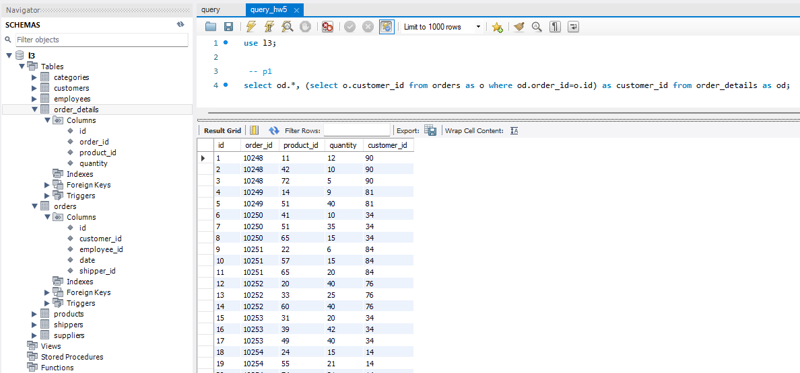
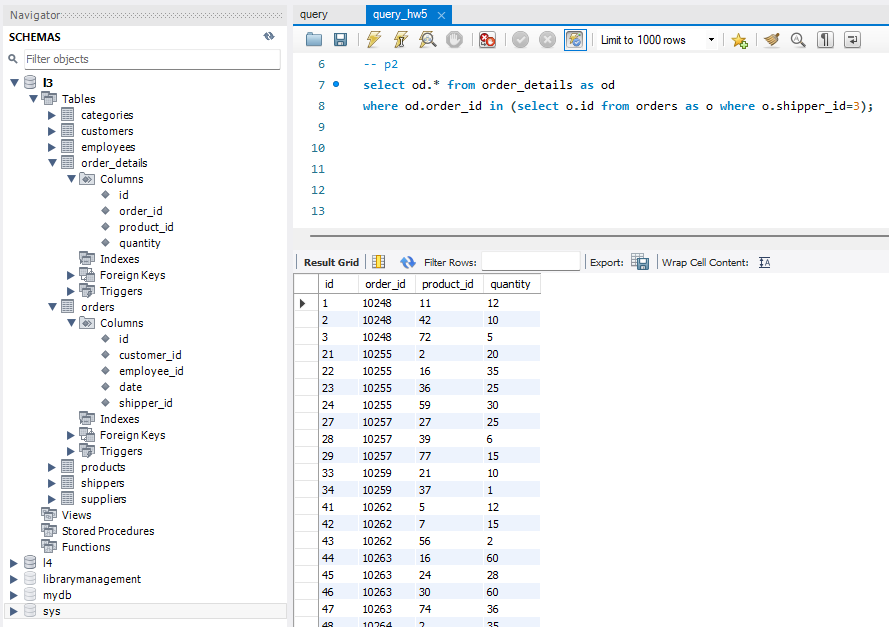
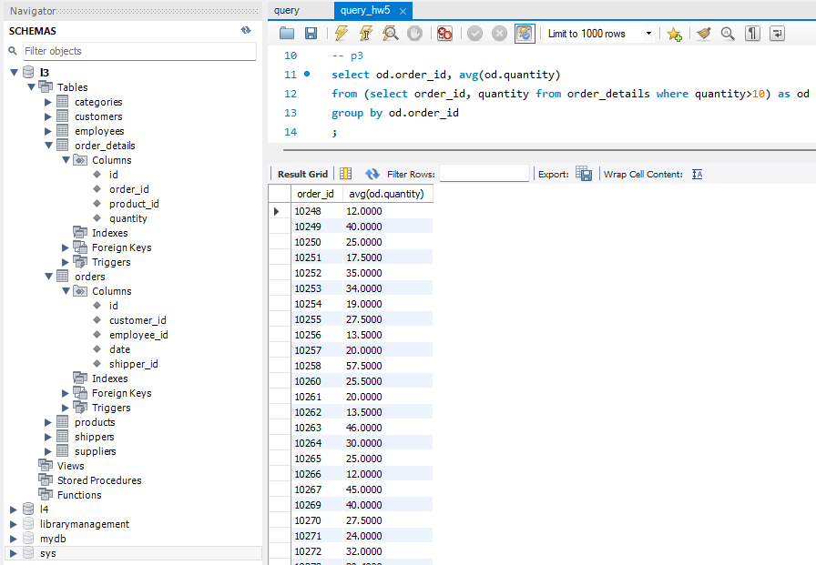
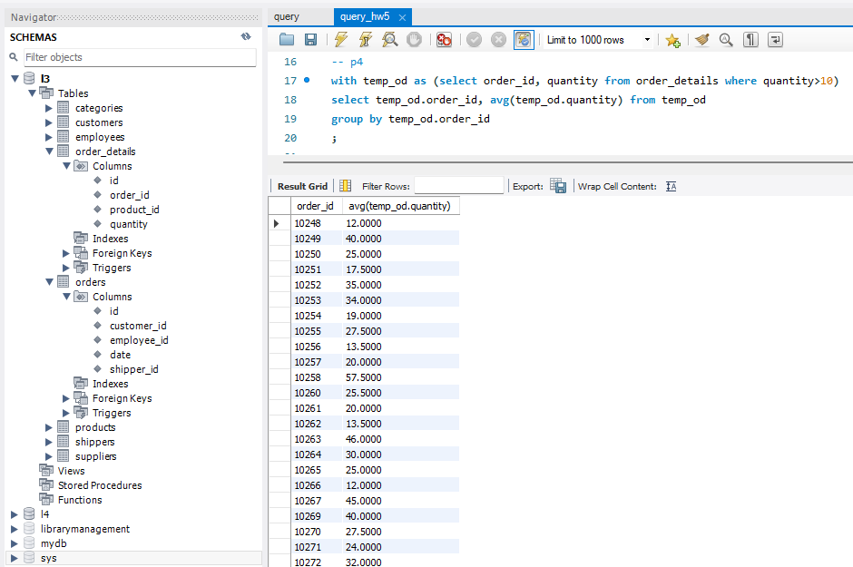
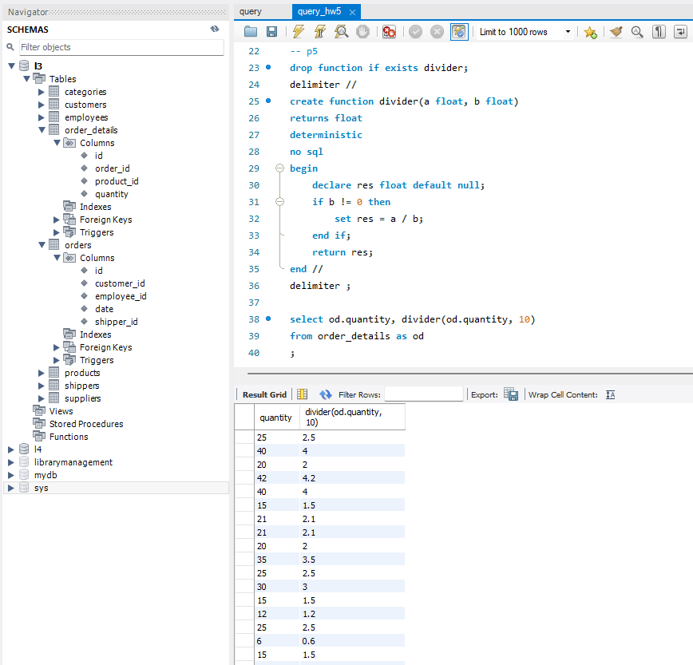

## Домашнє завдання до Теми 5. Вкладені запити. Повторне використання коду

### Виконання.

 1. Напишіть SQL запит, який буде відображати таблицю `order_details` та поле `customer_id` з таблиці `orders` відповідно для кожного поля запису з таблиці `order_details`. Це має бути зроблено за допомогою вкладеного запиту в операторі `SELECT`.

```sql
select od.*, (select o.customer_id from orders as o where od.order_id=o.id) as customer_id from order_details as od;
```


 2. Напишіть SQL запит, який буде відображати таблицю `order_details`. Відфільтруйте результати так, щоб відповідний запис із таблиці `orders` виконував умову `shipper_id=3`. Це має бути зроблено за допомогою вкладеного запиту в операторі `WHERE`.

```sql
select od.* from order_details as od
where od.order_id in (select o.id from orders as o where o.shipper_id=3);
```


 3. Напишіть SQL запит, вкладений в операторі `FROM`, який буде обирати рядки з умовою `quantity>10` з таблиці `order_details`. Для отриманих даних знайдіть середнє значення поля `quantity` — групувати слід за `order_id`.

```sql
select od.order_id, avg(od.quantity)
from (select order_id, quantity from order_details where quantity>10) as od
group by od.order_id;
```


 4. Розв’яжіть завдання 3, використовуючи оператор `WITH` для створення тимчасової таблиці `temp`. Якщо ваша версія MySQL більш рання, ніж 8.0, створіть цей запит за аналогією до того, як це зроблено в конспекті.

```sql
with temp_od as (select order_id, quantity from order_details where quantity>10)
select temp_od.order_id, avg(temp_od.quantity) from temp_od
group by temp_od.order_id;
```


 5. Створіть функцію з двома параметрами, яка буде ділити перший параметр на другий. Обидва параметри та значення, що повертається, повинні мати тип `FLOAT`. Використайте конструкцію `DROP FUNCTION IF EXISTS`. Застосуйте функцію до атрибута quantity таблиці `order_details` . Другим параметром може бути довільне число на ваш розсуд.

```sql
drop function if exists divider;
delimiter //
create function divider(a float, b float)
returns float
deterministic
no sql
begin
	declare res float default null;
    if b != 0 then
        set res = a / b;
	end if;
    return res;
end //
delimiter ;

select od.quantity, divider(od.quantity, 10)
from order_details as od;
```


